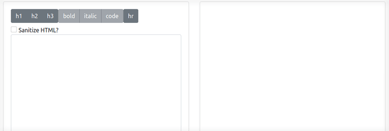

# Typescript Markdown Compiler

A markdown compiler written in typescript with a react frontend.

A live version of this app is available [here](https://nroboto-markdown-editor.herokuapp.com/).

**Note:** This compiler shouldn't be used for production purposes as it is only intended as an example, instead use a library such as [markedjs](https://github.com/markedjs/marked). This compiler currently contains many bugs and lacks support for core markdown functionality.
